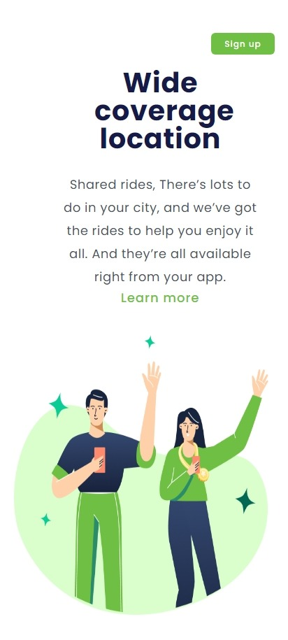

#  Wide coverage location
 
<h2>Olá, Tudo Bem ? Seja bem vindo. </h2>
<h2>Esses foram meus primeiros projetos comcluidos e publicados na web, Ate o presente momento, cursando Desenvolvimento Web Front End na plataforma: <a href="https//rodolfomore.com.br/deviclub">DevClub.</a></h2>

Nesses Projetos Foram Utilizadas as seguintes Ferramentas:

 
 

 

Projetos Focados Em Responcividade, criando adaptações de sites para equipamentos menores Como mostra a imagem abaixo.

